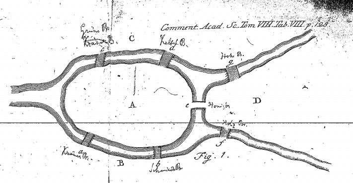
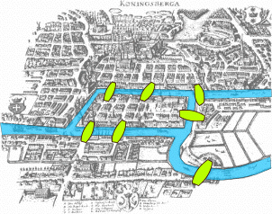
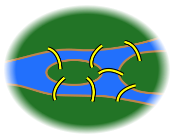
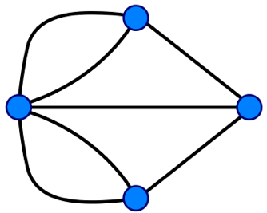
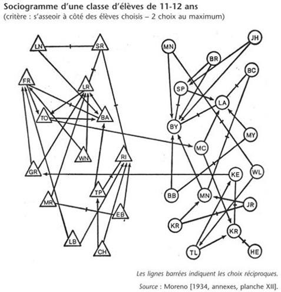
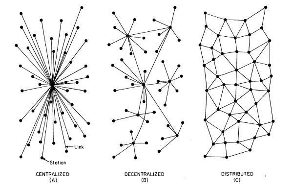

title: Advanced Python for Social Scientists
slug: graph-theory
class: animation-fade
layout: true

<!-- This slide will serve as the base layout for all your slides -->

.bottom-bar[
  {{title}}
]

---

class: impact

# {{title}}

_PSIA Spring Semester 2023_

---

class: middle, center

# Graph theory

[https://yomguithereal.github.io/psia-python-advanced/decks/{{slug}}](https://yomguithereal.github.io/psia-python-advanced/decks/{{slug}})

---

# What is a graph?

Networks, graphs etc. are the same thing:

1. Nodes (or vertices)
2. Links (or edges)

Very abstract data structure that can represent a wide variety of things.

Nodes & edges can very well hold their own additional metadata.

---

# A complex mathematical object

Still being studied and haven't released all their secrets.

But they can be drawn as maps to visually grasp complexity in a powerful (but sometimes misleading) way.

As a rule of thumb, always be wary of the wow effect in dataviz.

Let's learn **visual network analysis** then.

---

class: center, middle

# The seven bridges of Koenigsberg

---

class: center, middle

---

class: center, middle

---

class: center, middle

---

# Kinds of graphs

- Directedness
- Multiplicity
- Self loops

---

class: center, middle

# Moreno's sociograms

---

class: center, middle

# Graph topology and paths

---

class: center, middle

*How can we find suitable positions for nodes in 2d space?*

---

# Spatial layout algorithms

Nodes don't have a position in 2d space as they only exists within a network's topology.

Using a incremental algorithm (in our case *ForceAtlas2* by Jacomy et al.), we can find a suitable position for them.

The goal being to respect the following intuition: nodes should be close to another in 2d space if they are close in the network's topology itself (i.e. the path from source to target in the network should be short).

This produces isotropic spaces where only distances have a meaning and where x and y axis are meaningless.

☝️ this is the source of so much confusion!

---

class: center, middle

Let's see how all of this works by using the following online tool:

https://medialab.github.io/nansi/

???

Test those files:

1. C. Elegans
2. EuroSIS

---

# Structural features

1. Zones
2. Clusters
3. Hubs, autorities, bridges etc.
4. Emptiness

---

# Visual variables & graph theory concepts

Reminder about Bertin and semiology of graphics.

1. Node size (degree)
2. Node color (categories)
3. Edge size
4. Edge shape
5. etc.

---

class: center, middle

*How can we detect communities in a graph?*

---

# Community detection algorithms

* By homophily
* By center/periphery etc.
* By connectivity profile

=> Always a NP-hard problem that requires clever optimization methods.

The most famous one being named the "Louvain" algorithm.

???

This is a good spot to speak about algorithmic complexity if it wasn't done earlier.

---

# Bipartiton

---

# Practical work

---

class: middle, center

# See you next week!
